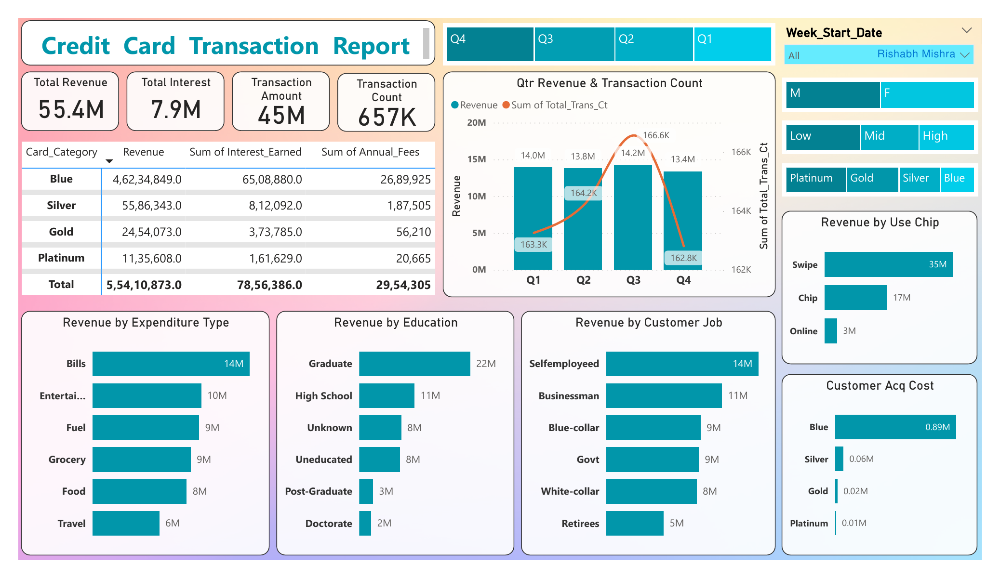
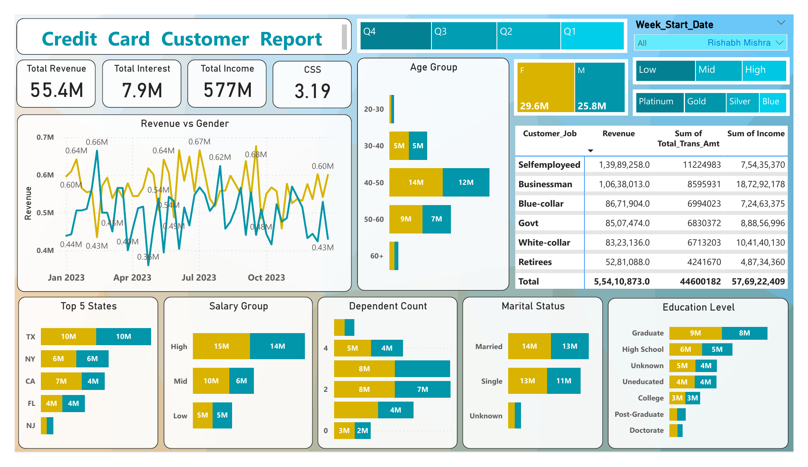

# 💳 Credit Card Financial Dashboard (Power BI)

**1. Project Title :** _Credit Card Financial Performance Dashboard_

An interactive Power BI dashboard designed to analyze credit card revenue, transaction activity, customer segments, card usage, and quarterly financial performance.

**2. Purpose:**

- The Credit Card Financial Dashboard provides visual insights into total revenue, total interest, transaction amount, transaction count, customer income, and customer satisfaction score.
- It helps analyze revenue contribution by card category, expenditure type, education level, customer job, gender, age group, salary group, and state.

**3. Tech Stack:**

The dashboard was built using the following tools and technologies:

- Power BI Desktop : Dashboard development and visualization

- SQL : Database creation, table creation, and CSV data import

- Power Query : Data cleaning and transformation

- DAX : KPIs, calculated columns, and revenue measures

- Data Modeling : Customer and credit card transaction tables connected for analysis

- File Formats : .pbix, .csv, .sql, .png, .pdf

**4. Data Source:**

Credit Card Financial Dataset

The dataset consists of:

Credit Card Details – Client number, card category, annual fees, credit limit, transaction amount, transaction count, interest earned, chip usage, expenditure type, and delinquent account details

Customer Details – Client number, customer age, gender, education level, marital status, state, job, income, salary group, dependent count, and satisfaction score

Additional Weekly Data – Extra customer and transaction records used for updated reporting

**5. Features:**

**Business Problem:**

Banks need to monitor credit card transactions and customer data to answer:

1. What is the total revenue, interest, transaction amount, and transaction count?

2. Which card categories generate the highest revenue?

3. Which expenditure types contribute more to revenue?

4. How does revenue vary by customer job, education, age, gender, and salary group?

5. How do revenue and transaction count change across quarters?

**Goal of the Dashboard:**

To create an analytical Power BI dashboard that:

- Tracks total revenue, interest, transaction amount, and transaction count
- Analyzes revenue by card category, expenditure type, customer job, and education
- Compares customer revenue by gender, age group, salary group, marital status, and state
- Shows quarterly revenue and transaction count trends
- Helps identify high-value customer and transaction segments

**Walkthrough of Key Visuals:**

**i) KPI Tiles**

- Total Revenue
- Total Interest
- Transaction Amount
- Transaction Count
- Total Income
- Customer Satisfaction Score

**ii) Credit Card Transaction Report**

Shows transaction-level insights such as revenue by card category, expenditure type, education level, customer job, chip usage, customer acquisition cost, and quarterly revenue with transaction count.

**iii) Credit Card Customer Report**

Shows customer-level insights such as revenue by gender, age group, salary group, dependent count, marital status, education level, customer job, and top states.

**iv) Quarter Revenue & Transaction Count**

Compares revenue and transaction count across Q1, Q2, Q3, and Q4.

**v) Revenue by Use Chip**

Compares revenue generated through Swipe, Chip, and Online transaction methods.

**Business Impact & Insights**

1. Revenue Monitoring: Track total revenue, interest, transaction amount, and transaction count

2. Customer Segmentation: Analyze customers by age, gender, salary, job, education, and marital status

3. Card Performance: Identify revenue contribution by card category

4. Transaction Analysis: Compare revenue by expenditure type and chip usage

5. Decision Support: Help stakeholders monitor credit card operations and financial performance

**6. Dashboard Preview:**

### Transaction Report

### Customer Report

## 👩‍💻 Author

**Vibha Pateshwari**  
🔗 GitHub: https://github.com/VibhaCodes
